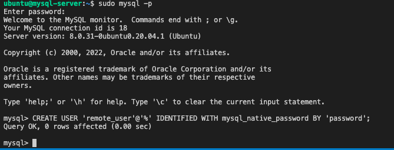
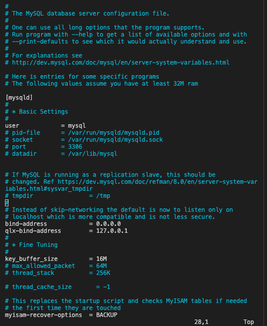
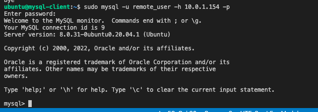

## Client/Server Architecture Using A MySQL Relational Database Management System
### TASK – Implement a Client Server Architecture using MySQL Database Management System (DBMS).
#### Steps
1. Spin up two Linux-based virtual servers (EC2 instances in AWS) and name them: `mysql server` and `mysql client` respectively.

2. Run sudo vi /etc/hostname
   Change IP to mysql-server
Run `sudo apt update -y` for latest updates on server.

2. Run sudo vi /etc/hostname
Change IP to mysql-server
Next, on **mysql server** install MySQL Server software: `sudo apt install mysql-server -y`
4. On **mysql client** install MySQL Client software: `sudo apt install mysql-client -y`

OR 

ALTER USER 'root'@'localhost' IDENTIFIED WITH mysql_native_password by 'primaryMARS6969#';

5. Edit Inbound rule on **mysql server** to allow access to **mysql client** traffic. MySQL server uses TCP port 3306 by default. Specify inbound traffic from the IP
of **mysql cient** for extra security.

6. For **mysql client** to gain remote access to **mysql server** we need to create a database and a user on **mysql server**. To start with run the mysql security 
script: `sudo mysql_secure_installation` Follow the prompts and answer appropraitely to finish the process.

7. Run mysql command: `sudo mysql` This would take you to the mysql prompt (You may be required to input password if you opten for the validate password during 
the security script installation)

OR 

sudo mysql
ALTER USER 'root'@'localhost' IDENTIFIED WITH mysql_native_password by 'primaryMARS6969#';

8. Next, create the remote user with this following command: `CREATE USER 'remote_user'@'%' IDENTIFIED WITH mysql_native_password BY 'password';`

9. Create database with: `CREATE DATABASE test_db;`
10.  Then grant privieges to remote_user:  `GRANT ALL ON test_db.* TO 'remote_user'@'%' WITH GRANT OPTION;`
11.  . Finally, flush privileges and exit mysql : `FLUSH PRIVILEGES;`

12. Having created the user and database, configure MySQL server to allow connections from remote hosts. Use the following command: `sudo vi /etc/mysql/mysql.conf.d/mysqld.cnf`
13. In the text editor, replace the old **Bind-address** from ‘127.0.0.1’ to ‘0.0.0.0’ then save and exit.

14. Next, we restart mysql with: `sudo systemctl restart mysql`
15. From **mysql client** connect remotely to **mysql server** Database Engine without using SSH. Using the mysql utility to perform this action type:
`sudo mysql -u remote_user -h `sudo mysql -u remote_user -h  -p` and enter `password` for the user password.
 ss -p` and enter `password` for the user password.

16. This gives us access into the mysql server database engine.
17. Finally type: `Show databases;` to show the test_db database that was created.

